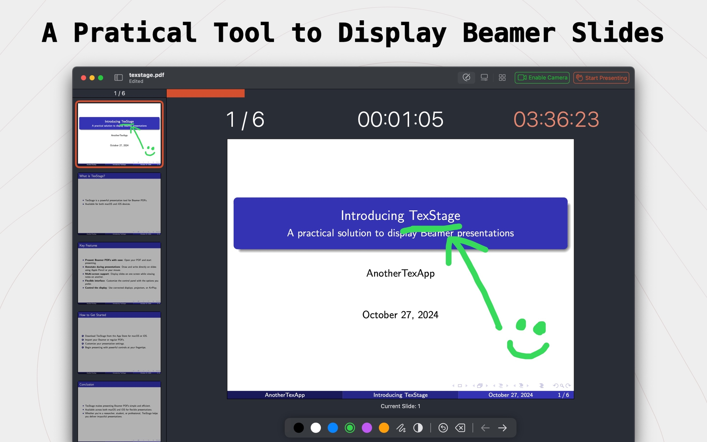

**TexStage** – Elevate your presentations with ease and flexibility. **TexStage** brings Beamer slides, PDFs, and video presentations to life, letting you present effortlessly with one click. Designed for both **macOS** and **iOS**, TexStage makes you the master of your presentation experience.

### Key Features
- **Effortless Control:** Launch your presentations in one click.
- **Customizable Interface:** Tailor the control panel to display only what you need.
- **Add & Edit Notes:** Seamlessly add and save notes directly within the app.
- **Interactive Tools:** Draw and display multiple slides simultaneously.
- **Camera Integration:** On Mac, integrate a live camera feed.
- **Multimedia Support:** Showcase not only PDFs but also video files.

[Download TexStage now](https://anothertexapp.com/texstage/appstore) to transform your presentations with a tool that combines simplicity, customization, and full multimedia support. Perfect for academic, professional, and public presentations alike.
