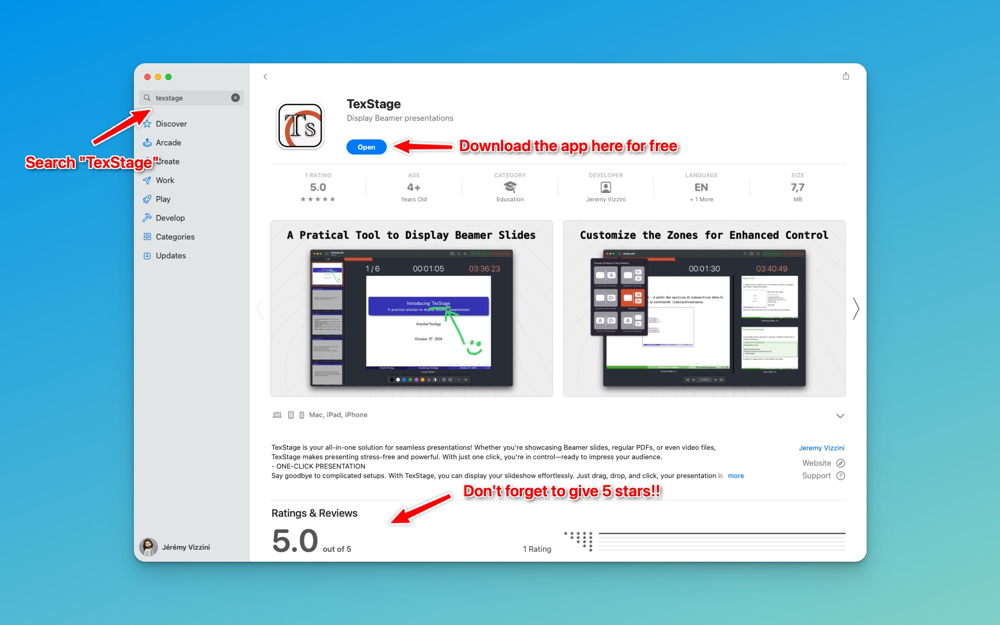

---

weight: 1  
type: docs  
title: Installing  
prev: /texstage/  
next: /texstage/on-mac  

---

To install TexStage, download the app from the App Store via this [link](https://anothertexapp.com/texstage/appstore). You can also follow the steps below.

### Installing TexStage on macOS

1. Open the **App Store** on your Mac.
2. Enter `TexStage` in the search bar.
3. Locate TexStage in the results and click **Get**.
4. The app will automatically download and install on your Mac.
5. After installation, find TexStage in your **Applications** folder.

> **Tip:** Make sure you have the latest version of macOS to enjoy all of TexStage’s features.

### Installing TexStage on iOS (iPhone and iPad)

1. Open the **App Store** on your iPhone or iPad.
2. Enter `TexStage` in the search bar.
3. Locate TexStage in the results and click **Get**.
4. The app will automatically download and install on your device.
5. Once installed, launch TexStage from your **Home Screen**.

> **Note:** TexStage is optimized for iPads, offering additional screen space and features to enhance your presentation experience.

And that’s it! You’re now ready to start using TexStage.