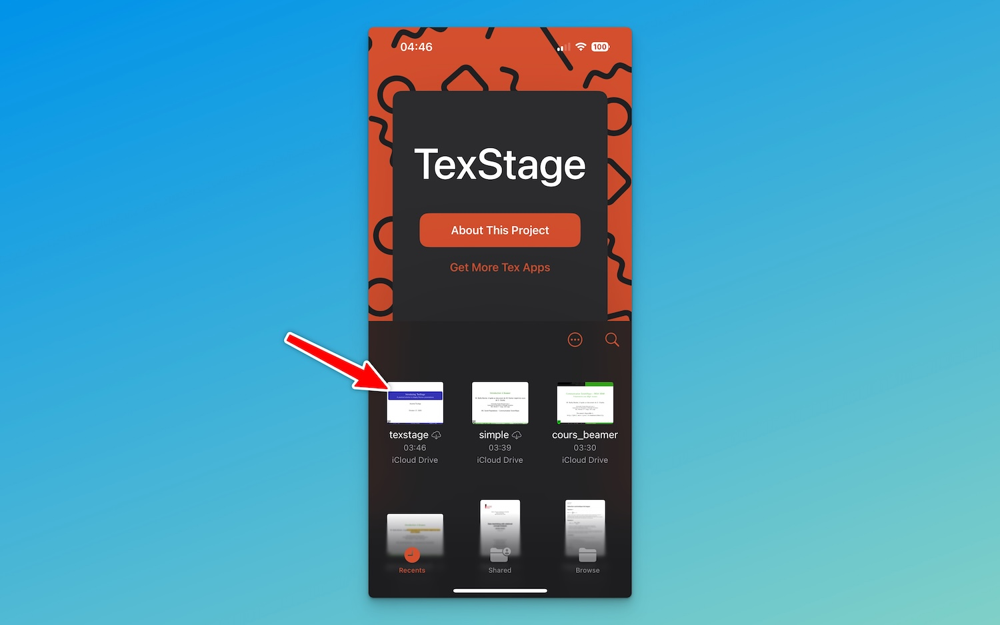
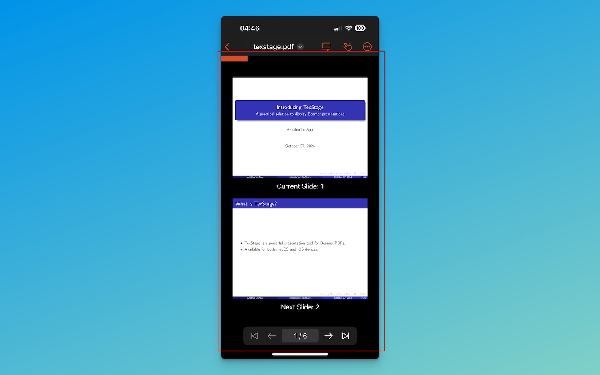

---

weight: 3
type: docs
title: On iOS
prev: /texstage/on-mac/share-camera  
next: /texstage/on-iphone-ipad/navigating  
sidebar:  
  open: true  
---

In this article, I’ll present the interface of TexStage for iOS, highlighting how each element works to enhance your presentation experience.

### First Step: Open a Document

1. Open **TexStage** on your iOS device.
2. Tap **File** to open your document.

### Navigation Bar: Your Central Control Hub

At the top of the TexStage interface, the Navigation Bar provides quick access to essential presentation controls. Three main buttons help you manage your presentation seamlessly: one for selecting the player mode, one for enabling the camera, and one for launching your presentation.

**Player Mode:** This button allows you to choose the interface mode that best suits your needs. Depending on whether you want to edit, preview, or browse slides, select the desired player mode for an optimal presentation workflow.

**Start Presentation:** The “Start Presentation” button immediately launches your presentation on the device using the main screen. This feature is particularly useful for presenting directly on an iPad.

**More Actions:** This button opens a menu with additional options, including settings, support, layout changes, and video opening features.

### Display Controls: Tailor Your View

The Navigation Bar includes options for selecting the control interface that aligns best with your presentation requirements. Choose between three view modes to suit different aspects of the presentation process:

- **Editor Mode:** Prepare your presentation materials in this mode, ideal for adding annotations, highlights, or other customizations before going live.

- **Viewer Mode:** This mode displays your slides exactly as they will appear to the audience, offering a full preview. You can also view upcoming slides and your notes.

- **Browser Mode:** The browser view provides a grid-style overview of all your slides, allowing you to quickly jump between slides and select the one you need at any point during your presentation.

With these flexible modes, you can effortlessly switch between preparation, preview, and slide navigation, adapting to the unique needs of each presentation.