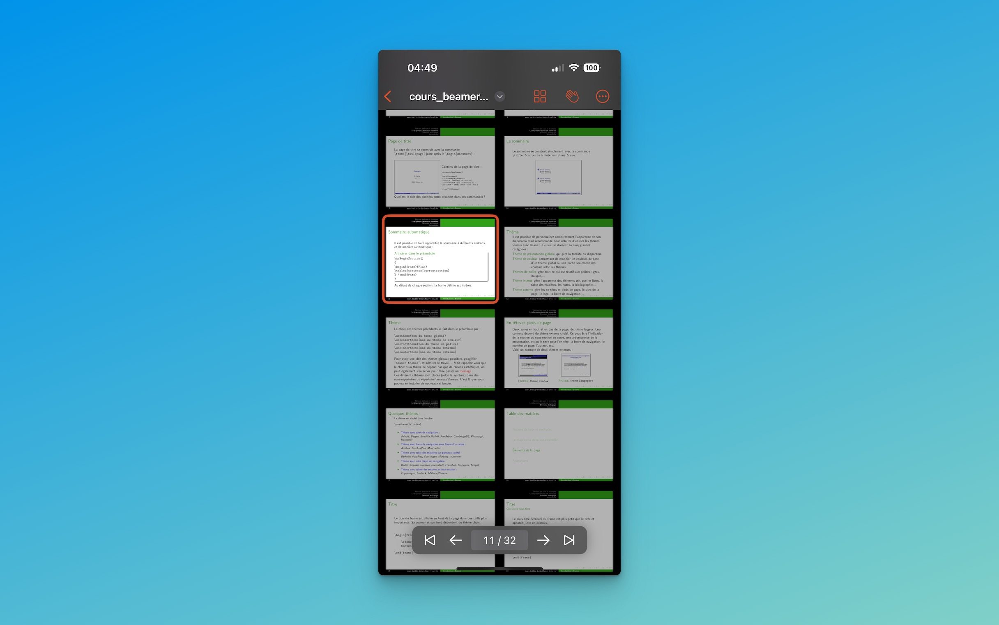

With Browser Mode, you can easily locate specific slides, arrange multiple slides for side-by-side viewing, and even select multiple slides at once with a simple command.

#### Effortless Slide Navigation

Browser Mode in TexStage provides a thumbnail view of all slides in your presentation, allowing you to quickly locate any slide you need. This view is particularly helpful in larger presentations, where scrolling through slides one by one can be time-consuming. Instead, you can visually scan through the thumbnails and jump directly to the slide you want to display. 
