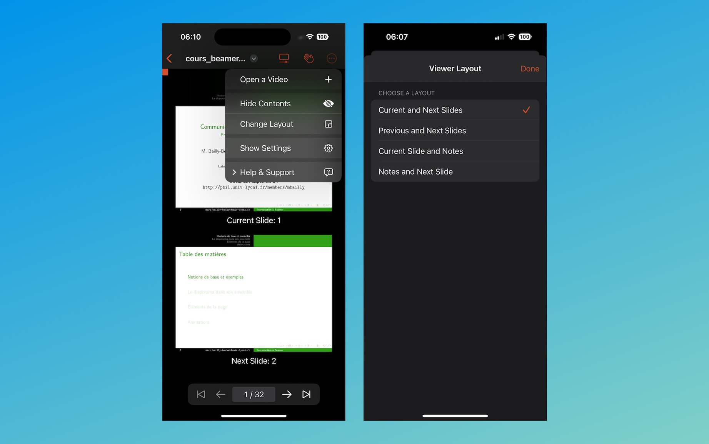

TexStage’s Viewer Mode offers presenters a streamlined, powerful way to manage their presentation flow with precision and ease. Designed to enhance control over what’s displayed on-screen, Viewer Mode lets you tailor your view, monitor progress, and manage your time efficiently—all from a single, adaptable interface.

#### Customizable Viewing Zones: Perfect Your Presentation Layout

In Viewer Mode, you can set up to two customizable zones, each configured to display the specific content you need to stay on top of your presentation. These zones allow you to select from:

1. **Previous Slide:** Keep track of where you’ve been by displaying the previous slide. This option is especially useful for maintaining context, helping you maintain continuity without relying on memory.

2. **Current Slide:** The focal point of your presentation, this option ensures the current slide is front and center, allowing you to stay aligned with what your audience is viewing.

3. **Next Slide:** Displaying the upcoming slide helps you anticipate your next talking points, keeping your presentation flow smooth and avoiding surprises.

4. **Current Notes:** The editable notes section is designed for presenters who want to have key talking points or additional content at their fingertips. Adjust your notes on the fly to better match your audience’s reactions, clarify points, or emphasize important information.

With these versatile zone options, Viewer Mode empowers you to customize your interface in ways that make sense for each unique presentation. Whether you prefer a simplified view or a layout with maximum control, TexStage adapts to you.

#### Editable Notes: Keep an Eye on Your Speech

Viewer Mode’s editable notes feature lets you update your presentation notes on the fly. You can add or change notes based on audience feedback, helping you present with confidence and flexibility.

#### Progress Tracking: Stay in Control

At the top of Viewer Mode, a **progress bar** visually indicates how far you’ve advanced in your presentation, providing a quick, intuitive sense of pace.

Take control with TexStage Viewer Mode, and experience a presentation flow that adapts to you.