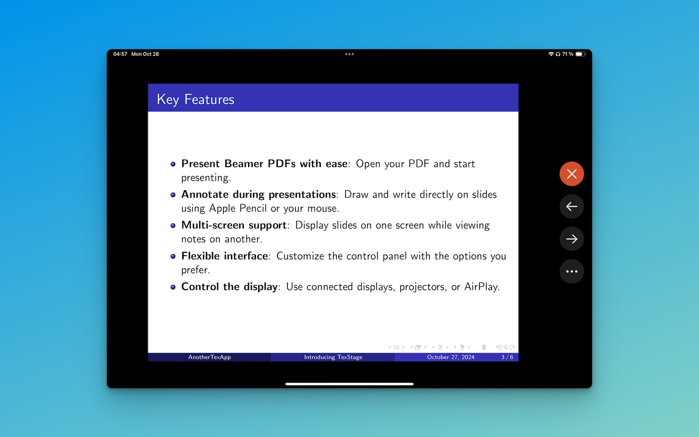

---

weight: 5  
type: docs  
title: Manage the Stage  
prev: /texstage/on-iphone-ipad/video/  
next: /texstage/remote-control/  
sidebar:  
  open: true  

---

TexStage’s stage support on iOS allows you to present directly on your device’s main screen—especially useful on iPad for on-the-go presentations—or to connect to an external display using AirPlay. With just a tap, you’re ready to present, whether it’s in a meeting room or from your iPad.

#### Start the Presentation

To start your presentation in TexStage, simply connect your device to AirPlay with a compatible TV or monitor. This feature provides a seamless experience, allowing you to move smoothly from preparation to presentation with minimal effort. Alternatively, tap the "On Device Presentation" button in the navigation bar to start a presentation directly on your device.

- **AirPlay Display**: For a larger audience, connect to an external screen via AirPlay. This feature ensures flexibility and accessibility, enabling your content to reach everyone in the room, even in larger spaces.
- **Main Screen Display**: Use your iOS device’s main screen for a straightforward presentation setup. This option is particularly handy on an iPad, giving you a clean and portable presentation experience.