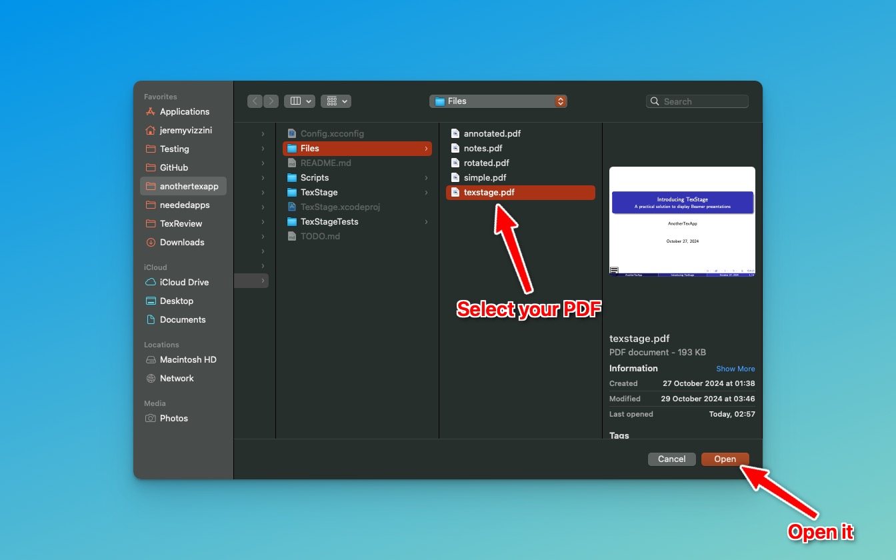
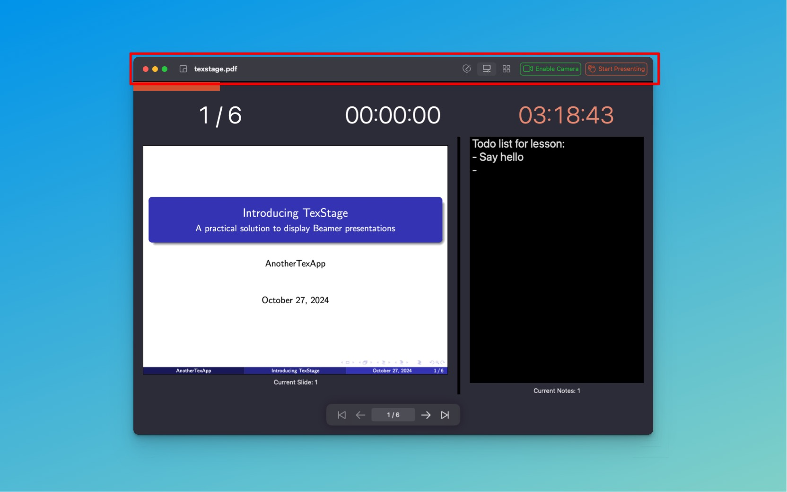

In this article, I’ll be presenting the interface of TexStage, highlighting how each element works to streamline your presentation experience.

### Fist step: Open a document

1. Open **TexStage** on your Mac.
2. From the **File** menu, select **Open**.
3. Navigate to your Beamer PDF file and click **Open** to import it into TexStage.

### Navigation Bar: Your Central Control Hub

At the top of the TexStage interface, the Navigation Bar provides quick access to key presentation controls. Three main buttons help you seamlessly manage your presentation: one for selecting the player mode, one for enabling the camera, and one for launching your presentation.

**Player Mode:** This button lets you choose the interface mode that best suits your needs. Depending on whether you want to edit, preview, or browse slides, select the desired player mode for an optimal presentation workflow.

**Enable Camera:** If you’re presenting on a Mac, this button activates your Mac’s built-in camera or a connected external camera. Adding a live video feed enriches your presentation, creating a more engaging and personal experience for your audience.

**Start Presentation:** The “Start Presentation” button immediately switches TexStage into presentation mode, displaying your slides on the designated screen. Once in this mode, you can navigate through slides or use the control panel to interact with your content effortlessly.

### Display Controls: Tailor Your View

The Navigation Bar includes options for selecting the control interface that best aligns with your presentation requirements. Choose between three view modes to suit different aspects of the presentation process:

- **Editor Mode:** Prepare your presentation materials in this mode, ideal for adding annotations, highlights, or other customizations before going live.

- **Viewer Mode:** This mode displays your slides exactly as they will appear to the audience, offering a full preview. You can also view upcoming slides and your notes.

- **Browser Mode:** The browser view provides a grid-style overview of all your slides, allowing you to quickly jump between slides and select the one you need at any point during your presentation.

With these flexible modes, you can seamlessly switch between preparation, preview, and slide navigation, adapting to the unique needs of each presentation.