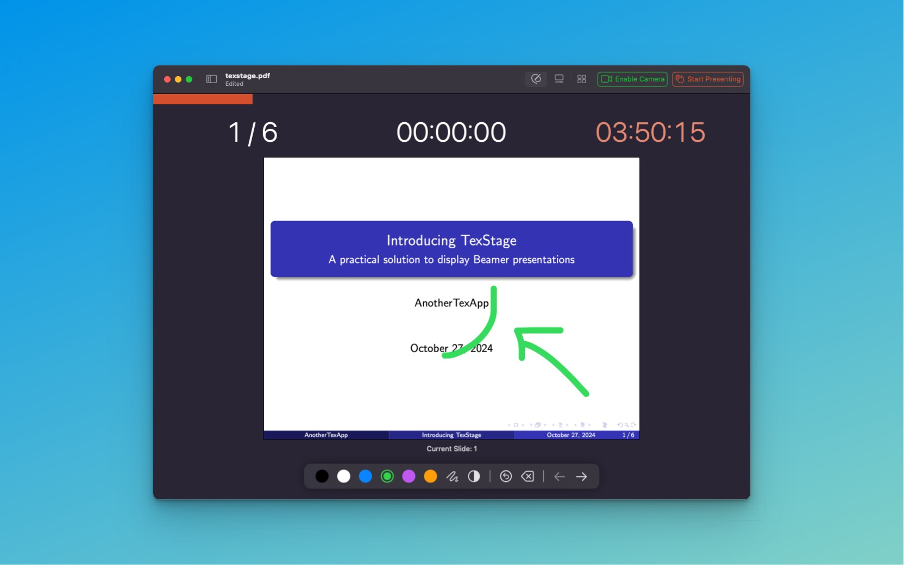

Editor Mode in TexStage is designed for presenters who want to enhance their slides with dynamic annotations, highlights, and custom markings. This mode offers a variety of drawing tools and color options, allowing you to interactively mark up slides in real time. Here’s a look at what Editor Mode can do and how it can add value to your presentations.

#### Drawing Tools for Enhanced Visuals

In Editor Mode, you can easily draw directly on your slides, making it ideal for emphasizing specific points, adding visual interest, or providing on-the-spot explanations. The main tools available include:

- **Line Tool:** Perfect for underlining text, connecting ideas, or drawing attention to key points, the line tool allows you to create precise lines on your slide.

- **Rectangle Tool:** Use the rectangle tool to create boxes around content, highlight sections, or even draw attention to specific elements. This tool is especially useful for visually grouping information on the slide.

Both tools can be customized with different colors, making it easy to use color-coding to indicate different types of information. In addition to line and rectangle tools, Editor Mode includes a **Fill Tool** that lets you fill the entire slide with white.

#### Undo and Redo: Flexible Editing for Real-Time Presentations

Mistakes happen, and TexStage’s Editor Mode has you covered with **Undo** and **Redo** options. These features allow you to make changes with confidence, knowing that any annotation or drawing can be quickly corrected.
