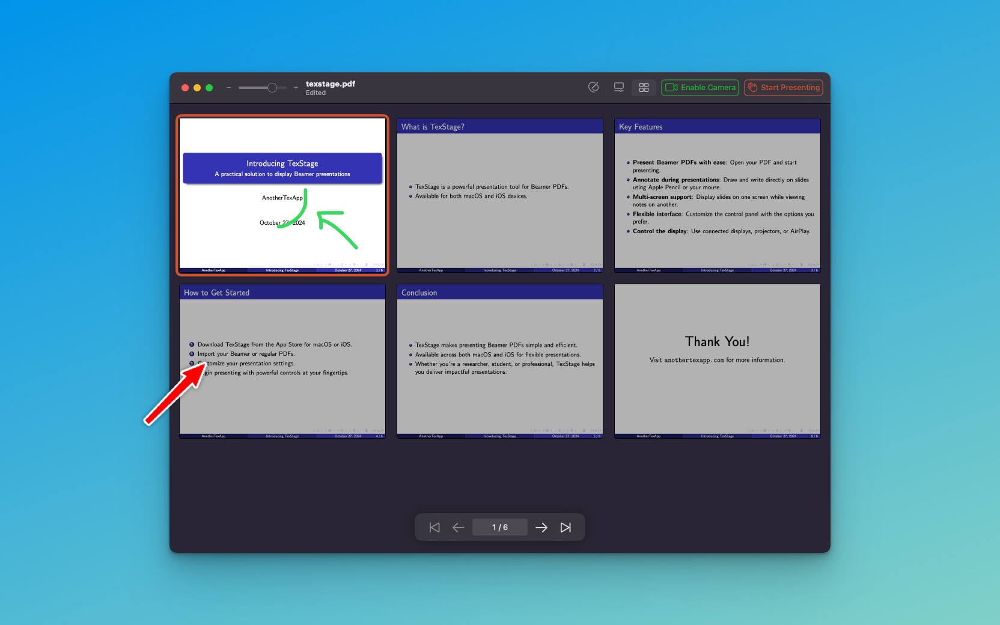
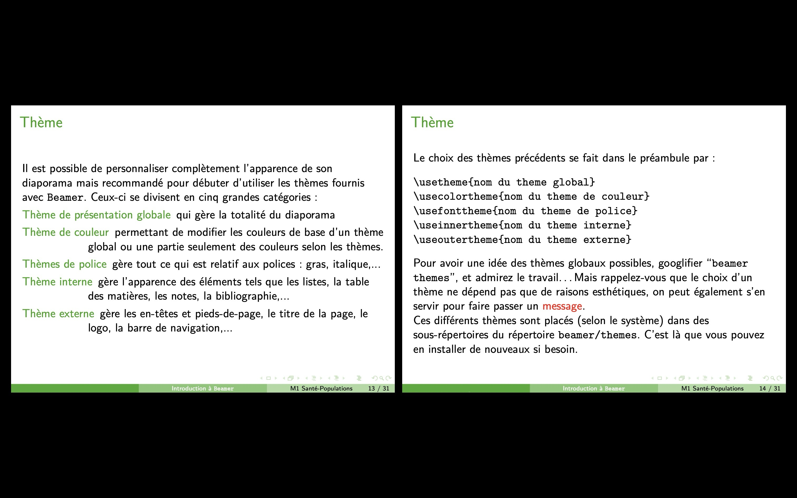

With Browser Mode, you can easily locate specific slides, arrange multiple slides for side-by-side viewing, and even select multiple slides at once with a simple command.

#### Effortless Slide Navigation

Browser Mode in TexStage provides a thumbnail view of all slides in your presentation, allowing you to quickly locate any slide you need. This view is particularly helpful in larger presentations, where scrolling through slides one by one can be time-consuming. Instead, you can visually scan through the thumbnails and jump directly to the slide you want to display. 

#### Multi-Slide Selection with Command Hold

One of the standout features of Browser Mode is the ability to select multiple slides at once by holding down the command key. This feature is ideal for presenters who want to highlight different sections of their presentation. You can pick several slides at a time and simultaneous display them.  By selecting multiple slides, you can quickly transition between key points, answer audience questions on specific topics, or provide a comparative view of related slides.