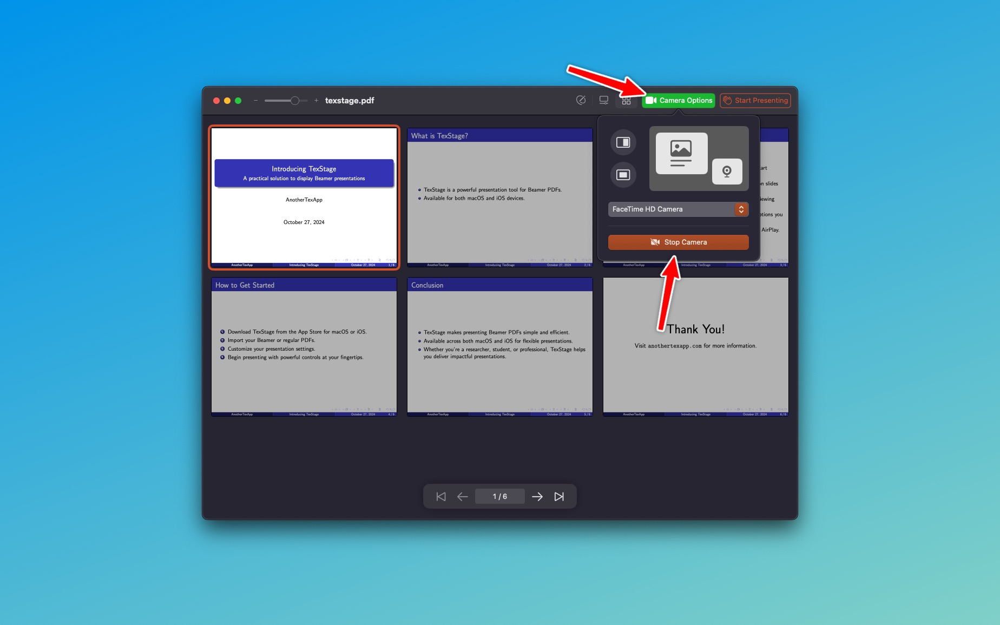

TexStage enhances your presentation experience by incorporating robust camera support specifically designed for Mac users. This feature allows you to easily enable the camera using the button in the navigation bar, giving you the flexibility to incorporate live video into your presentations seamlessly.

#### Camera Positioning

TexStage offers versatile options for displaying your camera feed in three distinct positions on the screen. You can choose to replace the current content with the camera feed, display it beside the main content, or position it in a corner of the screen. This flexibility allows you to customize your presentation layout to best suit your style and the needs of your audience.

#### Device Compatibility

You can utilize the built-in camera of your Mac, ensuring high-quality video directly from your device. If you prefer, you can also connect external cameras for enhanced video quality or use your iPhone or iPad camera wirelessly. This feature allows for greater versatility, especially when you need to capture different angles or when you want to showcase additional content during your presentation.