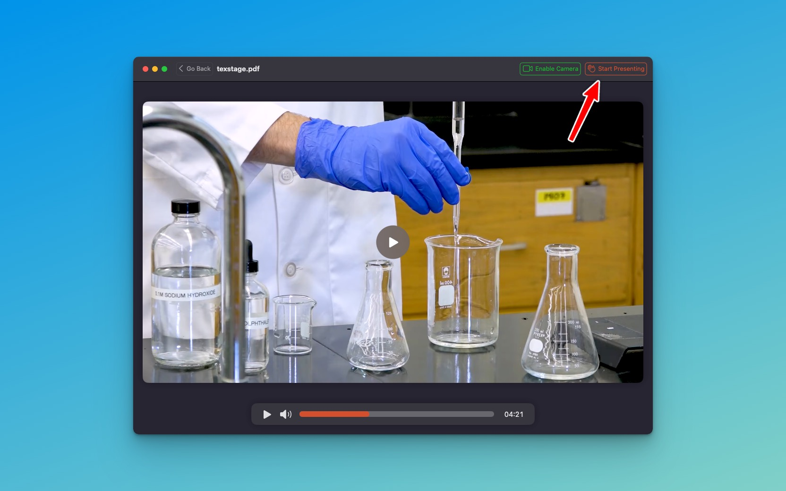

One of the key features that sets TexStage apart is its stage support, allowing you to present your content in an additional window, on the main screen, or via external screens—all with a simple, one-click setup. This ease of use empowers you to focus on your presentation rather than the technical details.

#### Start the Presentation

To start your presentation in TexStage, simply click the "Start Presentation" button located in the navigation bar. This user-friendly feature allows you to launch your presentation effortlessly, ensuring a smooth transition from preparation to delivery. With just one click, you're ready to present your content and make a lasting impression!

- **Additional Window Display:** You can launch the presentation in a separate window, giving you the freedom to manage notes or supplementary materials without disrupting the audience's view. This setup enhances your control and ensures a smoother flow during your presentation.
- **Main Screen Display:** When you want to keep things straightforward, the main screen display option allows you to showcase your content directly on the primary device. You can ensure that your audience sees exactly what you want them to see.
- **External Screens Display:** For larger venues, TexStage provides the option to display presentations on external screens. Connecting additional monitors or projectors is simple. This feature ensures that everyone in the room can engage with your content, regardless of where they are seated.

#### One-Click Switching

The beauty of TexStage’s stage support lies in its intuitive design. With the "X" key, switching between different display modes is effortless. TexStage goes a step further by allowing users to set their preferred default display mode in the app settings.