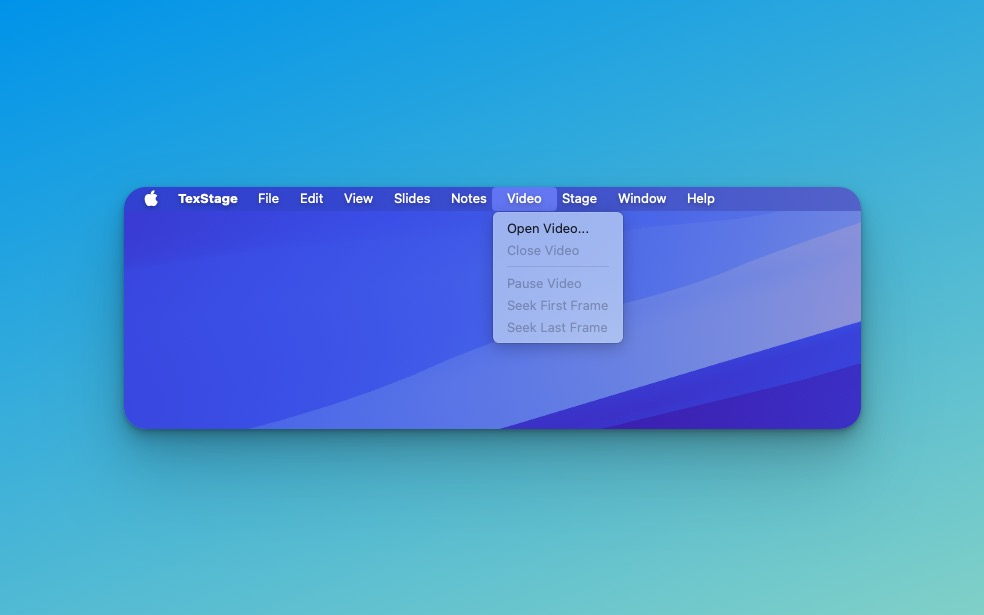
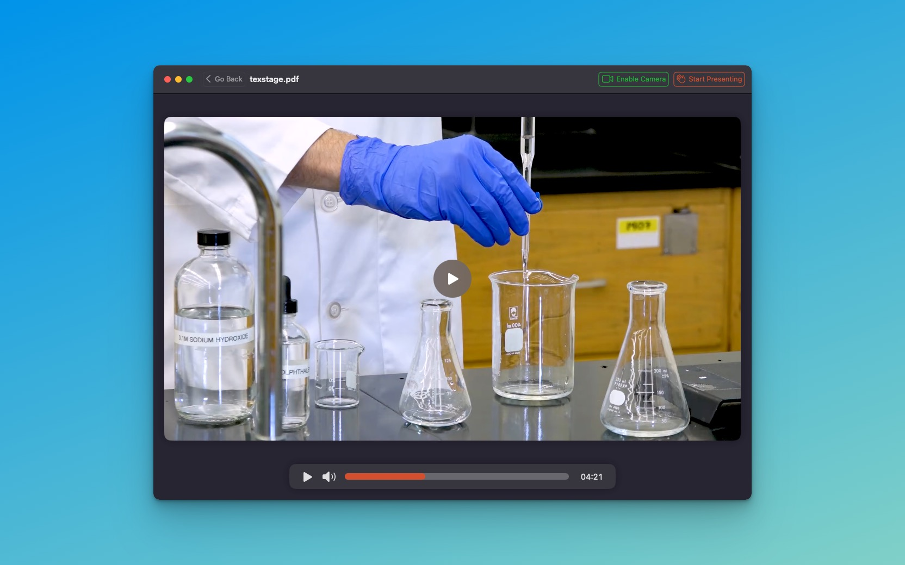

TexStage isn’t just a powerful tool for displaying PDFs and Beamer presentations; it also supports video playback, allowing you to integrate multimedia content directly into your presentations. This feature is especially useful for adding visual demonstrations, case studies, or any media that complements your presentation. In this article, we’ll walk you through how to load, play, and control video files within TexStage, ensuring a smooth multimedia experience for both you and your audience.

#### Loading a Video File

To get started with video playback in TexStage, you’ll first need to load a video file:
1. **Go to the Main Menu**: Open the main menu at the top of the TexStage interface.
2. **Select the "Video > Open Video" Option** which allows you to choose a video file from your Mac.
3. **Choose Your Video File**: Select your file, and TexStage will load it into the interface.

Once loaded, your video will appear within the TexStage interface, ready to be played alongside your slides and other presentation materials.

#### Controlling Playback

Once the video is loaded, use the control bar below the video to manage playback:

- **Play/Pause:** Click on the video or use the play/pause button to start or stop the video.
- **Mute/Unmute:** Toggle sound on or off as needed.
- **Seek to a Specific Time:** Drag the slider on the control bar to jump to any part of the video.

With these simple controls, you can seamlessly integrate video content into your presentation, making it more engaging for your audience.