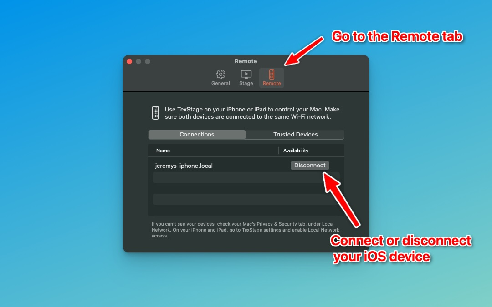
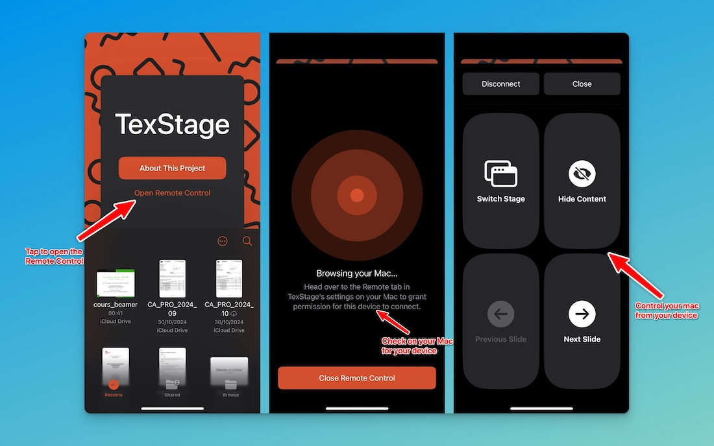

---

type: docs  
weight: 3  
title: Remote Control
prev: /texstage/on-iphone-ipad/stage/  
next: /texstage/latex  

---

TexStage offers a powerful remote control feature that allows you to control your Mac presentations directly from an iPhone or iPad, making it easy to navigate slides and interact with your presentation without needing to stay at your computer.

### Enable Remote Control on Mac

1. **Open TexStage on your Mac** and go to **Settings** from the main menu bar.
2. Navigate to the **Remote Control** tab.
3. If macOS prompts you, **allow TexStage to access the Local Network**. This permission enables your Mac to connect with your iOS device.

### Connect Your iPhone or iPad

1. Ensure your iPhone/iPad and Mac are **connected to the same Wi-Fi network**.
2. **Open TexStage on your iPhone or iPad**.
3. Tap the **"Open Remote Control"** button. The app will begin searching for your Mac. If iOS prompts you, **allow TexStage to access the Local Network**. This permission enables your device to connect with your Mac.
4. On your Mac, go to the **Remote Control** tab and look under **Available Devices** for your iOS device. If your device doesn’t appear, confirm both devices are on the same network and that Local Network access is enabled.
5. On your Mac, click the **Connect** button next to your device’s name to pair them.
6. Your devices are now paired and trusted, so you won’t need to repeat these steps in the future.

### Control the Presentation from iOS

Once connected, you can use your iPhone or iPad to control the presentation on your Mac.

- **Navigate Slides**: Tap left or right to move forward or backward in your presentation.
- **Switch Stage**: Choose which display screen shows your presentation.
- **Show/Hide Content**: Temporarily show or hide content on the screen.
- **Play/Pause Video**: If playing a video, control playback with a single tap.
- **Mute/Unmute Video**: Control the video’s volume directly from your device.

Now you’re all set to remotely control your presentations with TexStage! This feature is perfect for delivering presentations with ease and flexibility, letting you focus on engaging your audience.